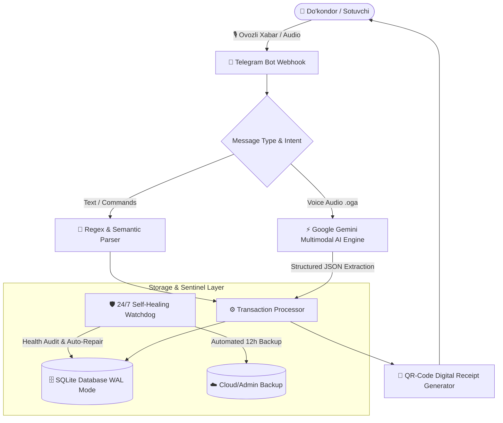

# 🎙️ Voice2Deal AI — Ovozli Savdo, Ombor & Nasiya Daftari AI Tizimi

<div align="center">

[](https://t.me/Ovozli_SavdoBOT)
[](https://ai.google.dev/)
[](https://www.docker.com/)
[](https://www.sqlite.org/)
[](LICENSE)

<p align="center">
  <b>O'zbekiston do'kondorlari va tadbirkorlari uchun sun'iy intellekt (Gemini AI) asosida ishlovchi avtomatlashtirilgan kassa, ombor va nasiya daftari Telegram boti.</b>
</p>

</div>

---

## 🏛️ System Architecture & Data Flow



---

## ✨ Asosiy Imkoniyatlar

- 🎙️ **Ovozli Savdo Kiritish:** Do'kondor o'zbek tilida (har qanday lahja va tezlikda) ovoz yuboradi — AI tushunib, kassa, qarz yoki omborga avtomatik yozadi.
- ⚡ **Bir vaqtda bir nechta mijoz:** «*Islomxon aka 70 ming, Javohir 50 ming qarzlarini to'lashdi*» kabi murakkab ovozlarni alohida ajratib yozish.
- 👥 **Xodimlar (Sotuvchilar) Tizimi:** Xo'jayin do'kon kodi orqali cheksiz sotuvchilarni ulaydi. Sotuvchi kiritgan savdolar darhol xo'jayin kassa hisobotida aks etadi.
- 📦 **Avtomatlashtirilgan Ombor (Sklad):** Tovar sotilishi bilan ombordan avtomatik kamayish va 5 tadan kam qolganda ogohlantirish.
- 🧾 **Elektron Chek & Kvitansiya:** Har bir savdo uchun mijozga yuboriladigan chiroyli QR-kodli elektron chek.
- 🤖 **24/7 AI Maslahatchi & Tirik Support:** Savollarga javob beruvchi sun'iy intellekt va adminga 2 tomonlama xabar yuborish.
- 🛡️ **Self-Healing & Auto-Recovery:** SQLite WAL yuqori tezlikli rejim, Gemini fallback modellar zanjiri va har 5 daqiqada o'z-o'zini ta'mirlovchi Sentinel Watchdog.

---

## 🚀 O'rnatish & Ishga Tushirish (Quickstart)

### 1-Usul: Docker Compose (Tavsiya etiladi ⭐️)
```bash
git clone https://github.com/salomh46-rgb/voice2deal-ai-bot.git
cd voice2deal-ai-bot
cp .env.example .env
# .env ichiga TELEGRAM_TOKEN va GEMINI_API_KEY kiriting
docker compose up -d --build
```

### 2-Usul: Manual Run
```bash
pip install -r requirements.txt
python bot.py
```

---

## 👨‍💻 Muallif & Dasturchi
- **Dasturchi:** [Javohirbek Asqarov (Jasper)](https://github.com/salomh46-rgb)
- **Portfolio:** [bestportfoliyo-o4z2.vercel.app](https://bestportfoliyo-o4z2.vercel.app/)
- **Telegram Bot:** [@Ovozli_SavdoBOT](https://t.me/Ovozli_SavdoBOT)
- **Litsenziya:** MIT License
